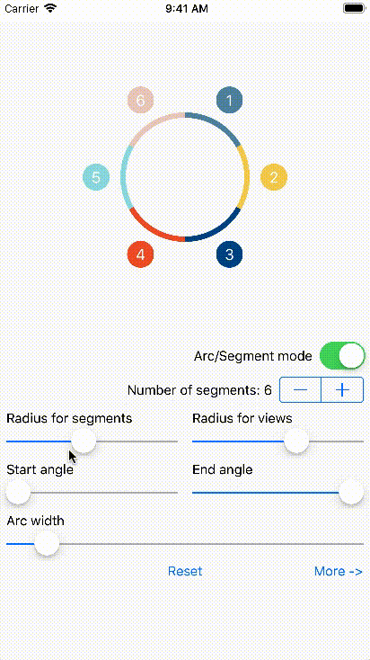
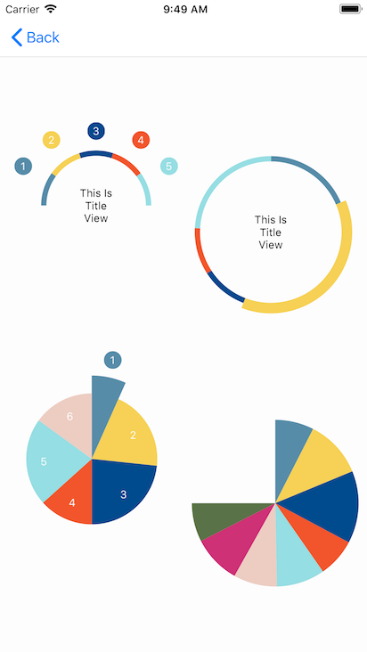

# SMDiagramViewSwift

Meet cute and very flexibility library for iOS application for different data view in one circle diagram. The opportunity of transformation of this sample make application interactive, colorful with wow-effect.

### [CocoaControls](https://www.cocoacontrols.com/controls/smdiagramview)

## Images




## Requirements

- Xcode 9
- iOS 9.x+
- Swift 4

## Be sure to read all instructions carefully.

### Installing with [CocoaPods](https://cocoapods.org)

```ruby
use_frameworks! 

pod 'SMDiagramViewSwift', '~> 1.0'
```


### Usage

Add a `UIView` instance in your .storyboard or .xib, set `SMDiagramView` class, connect `IBOutlet` and add `DataSource`

```swift
import SMDiagramViewSwift

class ViewController: UIViewController, SMDiagramViewDataSource {
    
    let dataSource = [1, 2, 3, 4, 5]
    
    @IBOutlet weak var diagramView: SMDiagramView!
    
    override func viewDidLoad() {
        super.viewDidLoad()
        
        diagramView.dataSource = self
    }
}
```

Setup `SMDiagramView` if need

```swift
    override func viewDidLoad() {
        super.viewDidLoad()
        
        diagramView.dataSource = self
        diagramView.minProportion = 0.1
        diagramView.diagramViewMode = .arc // or .segment
        diagramView.diagramOffset = .zero
        diagramView.radiusOfSegments = 80.0
        diagramView.radiusOfViews = 130.0
        diagramView.arcWidth = 6.0 //Ignoring for SMDiagramViewMode.segment
        diagramView.startAngle = -.pi/2
        diagramView.endAngle = 2.0 * .pi - .pi/2.0
        diagramView.colorOfSegments = .black
        diagramView.viewsOffset = .zero
        diagramView.separatorWidh = 1.0
        public var separatorColor = .white
}
```

`DataSource` functions

```swift
    //Required
    func numberOfSegmentsIn(diagramView: SMDiagramView) -> Int {
        return dataSource.count
    }
    
    //Optional
    func diagramView(_ diagramView: SMDiagramView, proportionForSegmentAtIndex index: NSInteger) -> CGFloat {
        return CGFloat(1/dataSource.count)
    }
    func diagramView(_ diagramView: SMDiagramView, colorForSegmentAtIndex index: NSInteger, angle: CGFloat) -> UIColor? {
        return .black
    }
    func diagramView(_ diagramView: SMDiagramView, viewForSegmentAtIndex index: NSInteger, colorOfSegment color:UIColor?, angle: CGFloat) -> UIView? {
        return UIView()
    }
    func diagramView(_ diagramView: SMDiagramView, offsetForView view: UIView?, atIndex index: NSInteger, angle: CGFloat) -> CGPoint {
        return .zero
    }
    func diagramView(_ diagramView: SMDiagramView, radiusForView view: UIView?, atIndex index: NSInteger, radiusOfSegment radius: CGFloat, angle: CGFloat) -> CGFloat {
        return 130.0
    }
    func diagramView(_ diagramView: SMDiagramView, radiusForSegmentAtIndex index: NSInteger, proportion: CGFloat, angle: CGFloat) -> CGFloat {
        return 80.0
    }
    func diagramView(_ diagramView: SMDiagramView, lineWidthForSegmentAtIndex index: NSInteger, angle: CGFloat) -> CGFloat {
        //not called for SMDiagramViewModeSegment
        return 6.0
    }
```


## Compatibility
  
  * IOS 9-11
  
## Changelog

### Version: 1.0

  * Initial Build

## Contributors

  * Contributors and stars are welcome.

## License

    Copyright 2017 VRG Soft

    Licensed under the Apache License, Version 2.0 (the "License");
    you may not use this file except in compliance with the License.
    You may obtain a copy of the License at

    [http://www.apache.org/licenses/LICENSE-2.0](http://www.apache.org/licenses/LICENSE-2.0)

    Unless required by applicable law or agreed to in writing, software
    distributed under the License is distributed on an "AS IS" BASIS,
    WITHOUT WARRANTIES OR CONDITIONS OF ANY KIND, either express or implied.
    See the License for the specific language governing permissions and
    limitations under the License.
